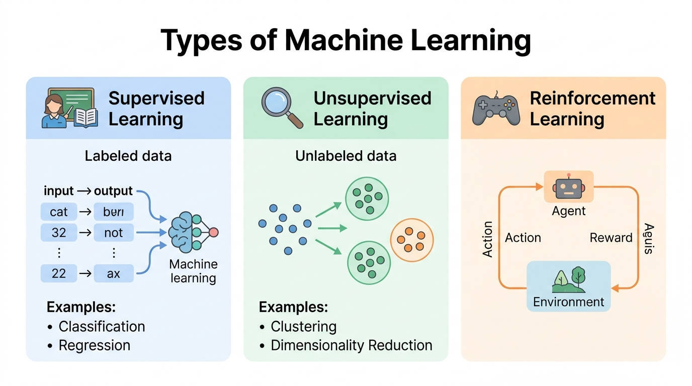
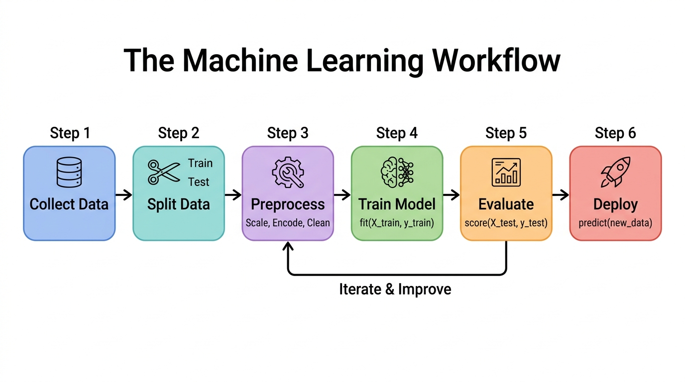
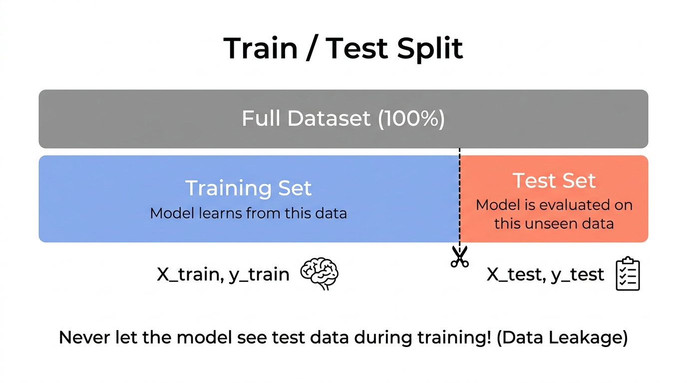
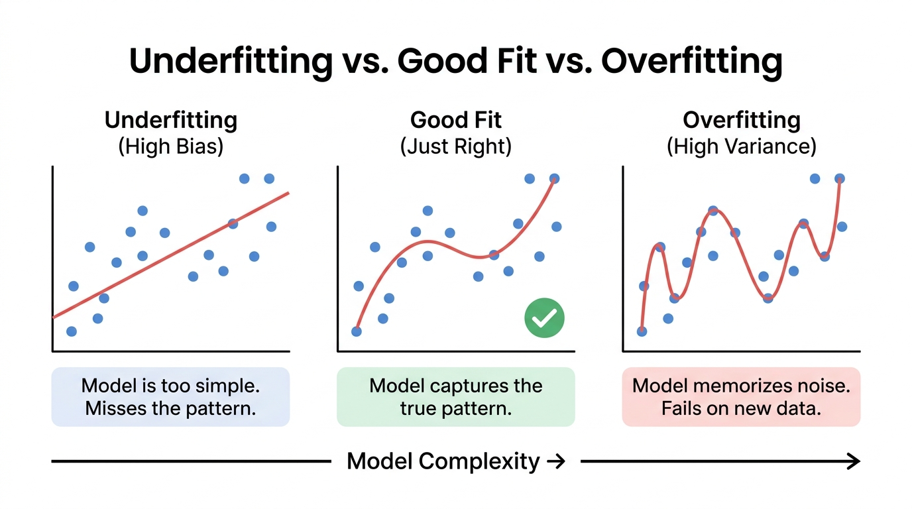
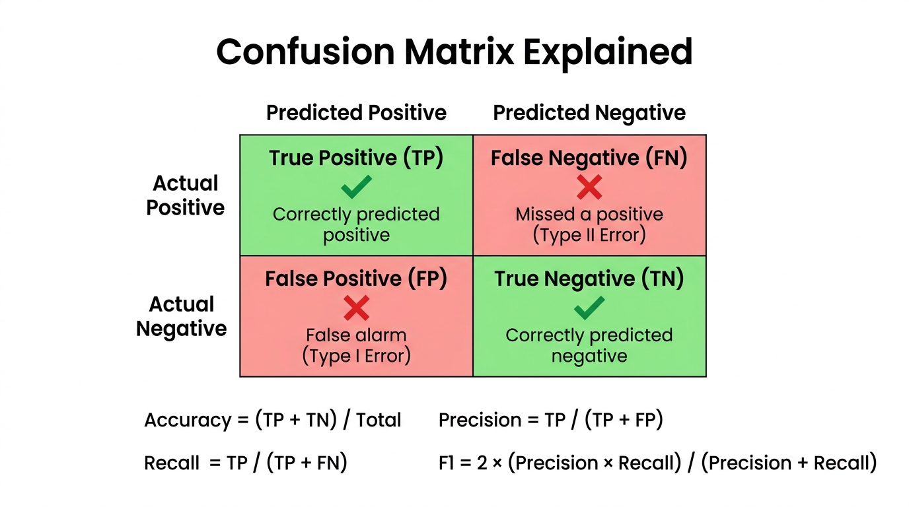

# Scikit-Learn Basics: Your First Steps in Machine Learning

Welcome to Machine Learning! This module is the gateway so before you train regression models, build classifiers, or cluster data, you need to understand the **foundations** of how ML works and how scikit-learn (sklearn) helps you do it.

---

## 1. What is Machine Learning?

### The Big Idea

In **traditional programming**, you write explicit rules:
```
IF temperature > 30 AND humidity > 80 THEN rain = True
```

In **machine learning**, the computer **learns the rules from data**:
```
Given thousands of weather records with outcomes →
the model discovers: "when temperature > 28.7 AND humidity > 73.2 → rain is likely"
```

> **Think of it like this:** Traditional programming is writing a recipe. Machine learning is tasting 1000 dishes and figuring out the recipe yourself.

### Types of Machine Learning



<br clear="all"/>

| Type | What It Does | Example |
|------|-------------|---------|
| **Supervised Learning** | Learns from labeled data (input → known output) | Predict house prices, classify emails as spam |
| **Unsupervised Learning** | Finds patterns in unlabeled data | Group customers by behavior, reduce dimensions |
| **Reinforcement Learning** | Learns by trial and reward | Game AI, robot navigation |

**In this module, we focus on Supervised Learning** so the most commonly used type in industry.

### The ML Workflow



<br clear="all"/>

Every ML project follows this pipeline:
1. **Collect Data** | Gather your dataset
2. **Split Data** | Separate into training and test sets
3. **Preprocess** | Scale features, encode categories, handle missing values
4. **Train Model** | Feed training data to an algorithm (`model.fit()`)
5. **Evaluate** | Test on unseen data (`model.score()`)
6. **Deploy** | Use the model on new data (`model.predict()`)

---

## 2. The Scikit-Learn Ecosystem

### What is scikit-learn?

**scikit-learn** (imported as `sklearn`) is the most popular Python library for classical machine learning. It provides:
- 🔧 **Preprocessing tools** | Scalers, encoders, imputers
- 🧠 **Algorithms** | Regression, classification, clustering, dimensionality reduction
- 📊 **Evaluation** | Metrics, cross-validation, model selection
- 🔗 **Pipelines** | Chain steps together into reproducible workflows

### The Consistent API Pattern

Every sklearn model follows the **same 3-method pattern**. Once you learn it for one model, you know it for ALL models:

```python
from sklearn.neighbors import KNeighborsClassifier

# 1. Create the model (with hyperparameters)
model = KNeighborsClassifier(n_neighbors=5)

# 2. Train the model on data
model.fit(X_train, y_train)

# 3. Make predictions on new data
predictions = model.predict(X_test)
```

| Method | What It Does | When You Call It |
|--------|-------------|-----------------|
| `.fit(X, y)` | Train the model on data | Once, on training data |
| `.predict(X)` | Generate predictions | After training, on new data |
| `.score(X, y)` | Evaluate accuracy | After training, on test data |
| `.transform(X)` | Transform data (preprocessors) | Scalers, encoders, etc. |
| `.fit_transform(X)` | Fit + transform in one step | Convenience method for training data |

> **Key Insight:** Whether you're using KNN, Random Forest, SVM, or any other algorithm — the API is always `.fit()`, `.predict()`, `.score()`. This is sklearn's superpower.

---

## 3. Built-in Datasets

Sklearn comes with several built-in toy datasets so perfect for learning without worrying about data cleaning or file formats.

```python
from sklearn.datasets import load_iris

# Load the famous Iris flower dataset
iris = load_iris()

print(iris.keys())          # dict_keys(['data', 'target', 'feature_names', ...])
print(iris.data.shape)      # (150, 4) → 150 samples, 4 features
print(iris.target.shape)    # (150,) → 150 labels
print(iris.feature_names)   # ['sepal length', 'sepal width', 'petal length', 'petal width']
print(iris.target_names)    # ['setosa', 'versicolor', 'virginica']
```

### Key Vocabulary

| Term | Meaning | In Iris |
|------|---------|---------|
| **Sample** (row) | One data point / observation | One flower measurement |
| **Feature** (column) | An input variable / attribute | Sepal length, petal width, etc. |
| **Target** (label) | The output we want to predict | Species: setosa, versicolor, virginica |
| **X** | Feature matrix (all inputs) | Shape: (150, 4) |
| **y** | Target vector (all labels) | Shape: (150,) |

### Common Built-in Datasets

| Dataset | Task | Samples | Features |
|---------|------|---------|----------|
| `load_iris()` | Classification | 150 | 4 |
| `load_wine()` | Classification | 178 | 13 |
| `load_digits()` | Classification | 1797 | 64 |
| `load_breast_cancer()` | Classification | 569 | 30 |
| `load_diabetes()` | Regression | 442 | 10 |
| `load_boston()` | Regression (deprecated) | 506 | 13 |

---

## 4. Train/Test Split

### Why Split?

If you train and test on the **same** data, the model will appear to perform perfectly | but it's just **memorizing** answers, not **learning** patterns. This is called **overfitting**.



<br clear="all"/>

We split data into:
- **Training set (70–80%)** | The model learns from this
- **Test set (20–30%)** | The model is evaluated on this **unseen** data

```python
from sklearn.model_selection import train_test_split

X_train, X_test, y_train, y_test = train_test_split(
    X, y,
    test_size=0.2,       # 20% for testing
    random_state=42,     # Reproducible results
    stratify=y           # Keep class proportions equal
)
```

### Key Parameters

| Parameter | What It Does | Best Practice |
|-----------|-------------|---------------|
| `test_size` | Fraction for test set | 0.2 or 0.25 |
| `random_state` | Seed for reproducibility | Any integer (42 is common) |
| `stratify` | Preserve class ratios in both sets | Always use for classification |

### What is Stratification?

If your dataset has 100 cats and 10 dogs, a random split might put all dogs in the test set. **Stratification** ensures both train and test sets maintain the same ratio (e.g., 90/10 in both).

### ⚠️ Data Leakage

**Data leakage** happens when information from the test set "leaks" into training. This gives falsely optimistic results.

**Common leakage mistakes:**
- Scaling the entire dataset before splitting
- Using test data to select features
- Filling missing values with statistics from the full dataset

**Rule:** Always split first, then preprocess.

---

## 5. Feature Scaling

### Why Scale Features?

Many ML algorithms compute **distances** between data points (KNN, SVM, neural networks). If one feature is in thousands (salary: 50,000) and another in single digits (years of experience: 5), the large-scale feature **dominates** the distance calculation.

**Before scaling:**
- Salary: 50,000 vs. 60,000 → difference = 10,000
- Experience: 3 vs. 5 → difference = 2
- The model thinks salary is 5000x more important!

**After scaling (both features to 0–1 range):**
- Salary: 0.5 vs. 0.6 → difference = 0.1
- Experience: 0.3 vs. 0.5 → difference = 0.2
- Both features contribute fairly

### StandardScaler vs MinMaxScaler

| Scaler | Formula | Result Range | Best For |
|--------|---------|-------------|----------|
| `StandardScaler` | $(x - \mu) / \sigma$ | Centered at 0, std = 1 | Most algorithms (default choice) |
| `MinMaxScaler` | $(x - x_{min}) / (x_{max} - x_{min})$ | [0, 1] | Neural networks, image data |

```python
from sklearn.preprocessing import StandardScaler

scaler = StandardScaler()

# CORRECT: Fit on training data ONLY, then transform both
scaler.fit(X_train)                    # Learn mean & std from training data
X_train_scaled = scaler.transform(X_train)  # Apply to training data
X_test_scaled = scaler.transform(X_test)    # Apply SAME transformation to test data

# SHORTCUT for training data:
X_train_scaled = scaler.fit_transform(X_train)  # fit + transform in one step
X_test_scaled = scaler.transform(X_test)         # ONLY transform (no fit!)
```

> **Critical Rule:** Never call `.fit()` or `.fit_transform()` on test data. The scaler must learn statistics (mean, std) only from training data to avoid data leakage.

---

## 6. Your First Model: K-Nearest Neighbors (KNN)

### How KNN Works

KNN is the simplest ML algorithm to understand so it makes predictions based on **similarity**.

**To classify a new flower:**
1. Calculate the distance from the new flower to ALL training flowers
2. Find the **K closest** training flowers (neighbors)
3. Take a **vote** so whatever species the majority of neighbors are, that's the prediction

```
New flower measurements: [5.0, 3.4, 1.5, 0.2]

5 nearest neighbors:
  1. Setosa     (distance: 0.14)
  2. Setosa     (distance: 0.22)
  3. Setosa     (distance: 0.31)
  4. Setosa     (distance: 0.45)
  5. Versicolor (distance: 0.89)

Vote: 4 Setosa vs 1 Versicolor → Prediction: SETOSA ✓
```

### Training and Predicting

```python
from sklearn.neighbors import KNeighborsClassifier

# 1. Create model with K=5 neighbors
knn = KNeighborsClassifier(n_neighbors=5)

# 2. Train (fit) on training data
knn.fit(X_train_scaled, y_train)

# 3. Predict on test data
y_pred = knn.predict(X_test_scaled)

# 4. Evaluate accuracy
accuracy = knn.score(X_test_scaled, y_test)
print(f"Accuracy: {accuracy:.2%}")  # e.g., "Accuracy: 96.67%"
```

### Choosing K

| K value | Behavior |
|---------|----------|
| K = 1 | Very sensitive to noise (overfitting) |
| K = 3–7 | Usually good balance |
| K = 100+ | Too smooth, misses patterns (underfitting) |



<br clear="all"/>

---

## 7. Evaluation Metrics

Getting a single "accuracy" number is not enough. You need to understand **how** the model is making mistakes.

### Confusion Matrix



<br clear="all"/>

```python
from sklearn.metrics import confusion_matrix, classification_report

# Generate confusion matrix
cm = confusion_matrix(y_test, y_pred)

# Full report with precision, recall, F1
print(classification_report(y_test, y_pred, target_names=iris.target_names))
```

### Key Metrics Explained

| Metric | Formula | What It Tells You | When To Use |
|--------|---------|-------------------|-------------|
| **Accuracy** | (TP + TN) / Total | Overall correctness | Balanced classes |
| **Precision** | TP / (TP + FP) | "Of predicted positives, how many were correct?" | When false alarms are costly (spam filter) |
| **Recall** | TP / (TP + FN) | "Of actual positives, how many did we find?" | When missing cases is costly (disease detection) |
| **F1-Score** | 2 × (P × R) / (P + R) | Harmonic mean of precision and recall | Imbalanced classes |

### When Accuracy Lies

Imagine a dataset with 95% "No Cancer" and 5% "Cancer":
- A model that **always predicts "No Cancer"** gets **95% accuracy**
- But it **misses every single cancer patient** | recall = 0%
- This is why you need precision, recall, and F1-score

---

## 8. Cross-Validation

### Why a Single Train/Test Split Isn't Enough

Your single split might be "lucky" or "unlucky" so the test set might happen to be easy or hard. **Cross-validation** gives a more reliable estimate by testing on **multiple different splits**.

### K-Fold Cross-Validation

**How it works (5-fold example):**
1. Split data into 5 equal parts (folds)
2. Train on folds 1-4, test on fold 5 → Score 1
3. Train on folds 1-3,5, test on fold 4 → Score 2
4. Train on folds 1-2,4-5, test on fold 3 → Score 3
5. Train on folds 1,3-5, test on fold 2 → Score 4
6. Train on folds 2-5, test on fold 1 → Score 5
7. **Final score = average of all 5 scores**

```python
from sklearn.model_selection import cross_val_score

scores = cross_val_score(knn, X_scaled, y, cv=5, scoring='accuracy')

print(f"CV Scores: {scores}")
print(f"Mean Accuracy: {scores.mean():.2%} ± {scores.std():.2%}")
```

### Benefits of Cross-Validation

| Benefit | Explanation |
|---------|-------------|
| More reliable estimate | Average over multiple test sets |
| Uses all data for testing | Every sample gets tested exactly once |
| Detects overfitting | High train score but low CV score = overfitting |
| Standard deviation | Tells you how stable the model is |

---

## 9. Pipelines: Putting It All Together

### The Problem Without Pipelines

```python
# Without pipeline — error-prone, repetitive, leaky
scaler = StandardScaler()
X_train_scaled = scaler.fit_transform(X_train)
X_test_scaled = scaler.transform(X_test)

model = KNeighborsClassifier(n_neighbors=5)
model.fit(X_train_scaled, y_train)
y_pred = model.predict(X_test_scaled)
```

What if you forget to scale the test data? What if you accidentally call `fit_transform` on test data? **Pipelines prevent these mistakes.**

### The Solution: sklearn Pipeline

A **Pipeline** chains preprocessing steps and the model into a single object:

```python
from sklearn.pipeline import Pipeline
from sklearn.preprocessing import StandardScaler
from sklearn.neighbors import KNeighborsClassifier

# Create a pipeline: scaler → model
pipe = Pipeline([
    ('scaler', StandardScaler()),       # Step 1: Scale features
    ('classifier', KNeighborsClassifier(n_neighbors=5))  # Step 2: Classify
])

# Now use it like a single model!
pipe.fit(X_train, y_train)        # Automatically: fit_transform scaler, then fit model
pipe.predict(X_test)              # Automatically: transform test data, then predict
pipe.score(X_test, y_test)        # Automatically: transform + score
```

### Why Pipelines Matter

| Without Pipeline | With Pipeline |
|-----------------|---------------|
| Manual scaling at each step | Automatic so no forgetting |
| Risk of data leakage | Leakage-proof by design |
| Can't use with cross-validation directly | Works seamlessly with `cross_val_score` |
| Hard to reproduce | Self-contained and reproducible |

### Pipelines + Cross-Validation = Best Practice

```python
from sklearn.model_selection import cross_val_score

# Cross-validate the entire pipeline (scaling + model)
scores = cross_val_score(pipe, X, y, cv=5, scoring='accuracy')
print(f"Pipeline CV Accuracy: {scores.mean():.2%} ± {scores.std():.2%}")
```

This ensures that scaling is applied correctly within each fold so the scaler only ever sees training data from that fold.

---

## Summary: The Complete ML Starter Template

```python
import numpy as np
from sklearn.datasets import load_iris
from sklearn.model_selection import train_test_split, cross_val_score
from sklearn.preprocessing import StandardScaler
from sklearn.neighbors import KNeighborsClassifier
from sklearn.pipeline import Pipeline
from sklearn.metrics import classification_report, confusion_matrix

# 1. Load data
iris = load_iris()
X, y = iris.data, iris.target

# 2. Split data
X_train, X_test, y_train, y_test = train_test_split(
    X, y, test_size=0.2, random_state=42, stratify=y
)

# 3. Build pipeline (preprocessing + model)
pipe = Pipeline([
    ('scaler', StandardScaler()),
    ('classifier', KNeighborsClassifier(n_neighbors=5))
])

# 4. Cross-validate
cv_scores = cross_val_score(pipe, X_train, y_train, cv=5, scoring='accuracy')
print(f"CV Accuracy: {cv_scores.mean():.2%} ± {cv_scores.std():.2%}")

# 5. Train on full training set
pipe.fit(X_train, y_train)

# 6. Evaluate on test set
y_pred = pipe.predict(X_test)
print(classification_report(y_test, y_pred, target_names=iris.target_names))
print(confusion_matrix(y_test, y_pred))
```

---

## Resources

- **Scikit-Learn User Guide (Official)** | https://scikit-learn.org/stable/user_guide.html
- **Scikit-Learn API Reference** | https://scikit-learn.org/stable/modules/classes.html
- **Scikit-Learn Tutorials** | https://scikit-learn.org/stable/tutorial/index.html
- **Hands-On Machine Learning (Aurélien Géron)** | https://www.oreilly.com/library/view/hands-on-machine-learning/9781098125967/
- **StatQuest: Machine Learning (YouTube)** | https://www.youtube.com/playlist?list=PLblh5JKOoLUICTaGLRoHQDuF_7q2GfuJF
- **3Blue1Brown: Neural Networks (YouTube)** | https://www.youtube.com/playlist?list=PLZHQObOWTQDNU6R1_67000Dx_ZCJB-3pi
- **Google ML Crash Course** | https://developers.google.com/machine-learning/crash-course
- **Kaggle Learn: Intro to ML** | https://www.kaggle.com/learn/intro-to-machine-learning
